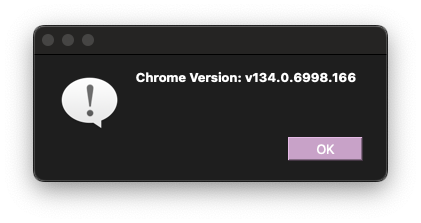
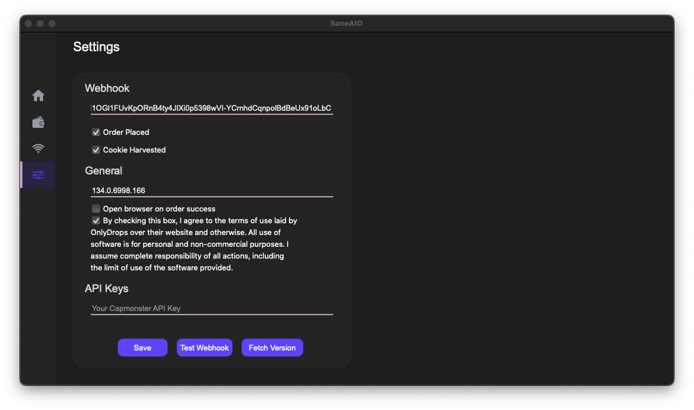

# Queue-Fair/District (Queue)

Once you've typed out or entered your ONLYACO KEY, press ENTER to continue.

!!! warning
      If you're sure about the key's validity, and it is still remarking it as "Invalid", reset your key using the "**$onlyaco reset"** command.

!!! info
      For any queries, open a ticket on the OnlyDrops server.

## SETTING PROXIES

From the previous page or any other page, clicking on the **WIFI ICON,** will take you to the proxy settings page.

* Copy your proxies or download a file from your proxy dashboard.
* Your proxies are usually in the **ip:port:user:pass** format which our automation natively supports. **IP Auth'ed** proxies are also supported and are usually easier to use for most. Ask your proxy provider or experienced users about the same and how to **IP auth** your proxies. Once IP authed, only **ip:port** is needed.
* Please make sure there is only one proxy per line (all proxies are separated).
* Make sure your proxies are not blocked, to verify - use chrome extensions like [**BP PROXY SWITCHER** ](https://chrome.google.com/webstore/detail/bp-proxy-switcher/bapeomcobggcdleohggighcjbeeglhbn?hl=en)and visit the websites.
* Once entered, give your proxy list a name and press **SAVE**.
* To **enter** **another proxy list**, use the drop down menu on the right of the name and switch it to **load list** and repeat the above process.
* To **delete**, select the PROXY LIST from the drop down menu and press on delete.

!!! warning
**NOTE:** Please make sure you only use **STICKY** proxies and not **ROTATING** proxies as your cookies might get mixed up (usually should not but to be on the safer side).

## **SETTINGS - Discord Webhook**

Clicking on the **SLIDER ICON** should navigate you to the settings page of the automation.

* Enter the webhook in the **"DISCORD WEBHOOK"** field. Once done, make sure you've checked the Order Placed checkmark for you to get the webhook. Should be checked by **default** as well.

* Remember to press **SAVE** to save the webhook in the automation. You can also **TEST WEBHOOK** to make sure you've set the right webhook.

* There is also an option to trigger the browser on a successful checkout, make sure that is **UNCHECKED** for this module to work correctly.

## **SETTINGS - Fetch Chrome Version**

* If the Chrome Version field is empty, click on the blue **Fetch Version** button on the bottom left. It will f**etch the latest Chrome Version installed** on your desktop. You should see this popup.

* Click on **OK**.

* Click on the blue **Save** button on the bottom left to make sure you save the Settings to SaneAIO.

.png)

## **TASK CREATION** 

Once all of the above have been set and saved, head over back to the homepage menu from the **HOME/HOUSE** icon.

1. Choose site/module, **Queue-Fair or District (Queue)** in this case.
2. There is only 1 way to set/monitor a queue link:
   1. **by Link: Enter a queue link (copied from the website) of the event in the Link Field**, eg.  [https://queue.district.in/tataipl2025pbksm22csk953452?target=https%3A%2F%2Fwww.district.in%2Fevent%2Ftata-ipl-2025-match-22-punjab-kings-vs-chennai-super-kings-in-new-chandigarh-april8%2Fbuy-page](https://queue.district.in/tataipl2025pbksm22csk953452?target=https%3A%2F%2Fwww.district.in%2Fevent%2Ftata-ipl-2025-match-22-punjab-kings-vs-chennai-super-kings-in-new-chandigarh-april8%2Fbuy-page), and **RA** in the **size/variant/qty field** (you can put any placeholder in there as it doesn't really matter).
3. Choose any **Profile** you want, it does not really matter. You can use the same profile to run all tasks.
4. Choose a **Proxy** list if you want to, highly recommended otherwise the website will block you requests later.
5. Keep the **Delay counters** at whatever you want, **5.0 on both is recommended if you're waiting for the drop**. On a live drop, **I recommend 1.0-3.0**.
6. Set the **Task Qty** counter to whatever you want, running 50+ is recommended.

### **SAMPLE CHECKOUT LOGS FLOW:**

1. The tool will check if the queue is live, and if it is, it will enter the queue.
2. The tool will keep Polling and checking your live time queue status, and provide you an update of the same in the Logs window.
3. Once passed, it will send you the passed queue link in a Discord Webhoo&#x6B;**.**

### **SAMPLE WEBHOOK:**

!!! info
      **Note:** Only use Chrome Browser to open the links.
!!! warning
      **Note:** The passed queue link in the webhook has an expiry of 10 minutes, and will only work on the Chrome Browser (and the same overall version, i.e, if you set 134.x.x.x, will work on any browser version that is of the same series) that you have set on the Chrome Version field.

Use **Start All** to start all tasks, **Stop All** to stop all tasks, **Delete All** to Delete all tasks.

To micromanage tasks, it has buttons by the side to manage it, and each should be simple to decipher by the icons.

## **COMMON FAQ/ERRORS**

