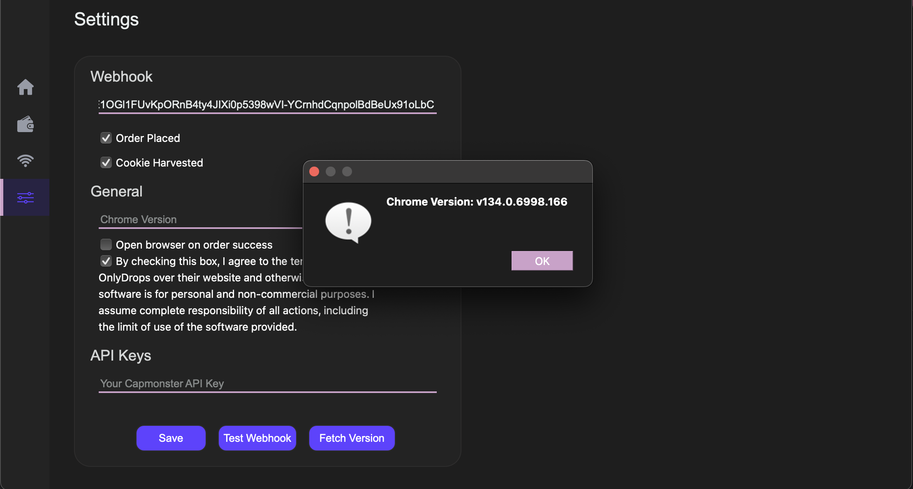

# SaneAIO Updates

## SaneAIO v3.17.3 - \[07/04/25]

**[SaneAIO v3.17.3 - Windows.zip](https://s3.onlytools.in/saneaio-downloadable-content/releases-or-downloads/SaneAIO%20v3.17.3%20-%20Windows.zip)**

**[SaneAIO v3.17.3 - MacOS.zip](https://s3.onlytools.in/saneaio-downloadable-content/releases-or-downloads/SaneAIO%20v3.17.3%20-%20MacOS.zip)**

### Changelogs

* Fixed some rate-limit triggering factors in District (Auto-Queue) module. Recommended to only run 30-40 seconds before the drop, and using proxies (10-20 tasks on localhost is fine).
* Fixed some issues with other Queue-Fair modules.
* Adding a monitor for monitoring the latest queue links to supplement the tool.

## SaneAIO v3.17.2 - \[25/03/25]

**[SaneAIO v3.17.2 - MacOS.zip](https://s3.onlytools.in/saneaio-downloadable-content/releases-or-downloads/SaneAIO%20v3.17.2%20-%20MacOS.zip)**

**[SaneAIO v3.17.2 - Windows.zip](https://s3.onlytools.in/saneaio-downloadable-content/releases-or-downloads/SaneAIO%20v3.17.2%20-%20Windows.zip)**

### Changelogs

* Added a field in **Settings** for you to **set your Chrome Browser's Version** (installed in your Mac/Windows desktop). \
  \
  The tool will automatically try to fetch the currently installed Chrome version on Startup, if that fails, you can use the **"Fetch Version"** button on the page to **fetch your currently installed Chrome version**, or **simply Copy and Paste your Chrome version** from [**Chrome Settings**](chrome://settings/help) (eg. just copy the numerical part **- 134.0.6998.166**)**.** **This is important to configure if you wish for the Queue-Fair links to work correctly.** 
* Fixed issues related to proxies + webhook found in the latest v3.17.1 update - **all Queue-Fair modules**.

 

**NOTE:**

* Download the 3.17.2 file for your operating system, **ONLY COPY the profiles.json, keys.json, and proxies.json file** (and **tasks.json file** if needed), also the **BMS folder** (if you have cards/upi saved), from the **old folder**, and **paste it in this NEW version's data folder.**
* **DO NOT COPY the old settings.json file**, the bot will crash upon opening since it will not find the new utilities.
* Unlike previous updates, directly copying and pasting the old **data** folder will not work and will give you an error. 

\--------------------------------------------------------------------------------------------------------------------

## SaneAIO v3.17.1 - \[19/03/25]

### Changelogs

* Added/Optimized **District Queue (QFair) module** that takes the Queue URL as input (queues multiple tasks and gives you a passed link).
* Added another **District Auto-Queue (QFair)** module that takes just the event link as input and checks for the latest queue configuration on the event page.
* Added a general **Queue-Fair** module that might support other sites using queue-fair queueing system as well.
* Fixed bugs/issues found in the latest v3.17 update - **BM (Card) module.**

**[SaneAIO v3.17.1 - Windows.zip](https://s3.onlytools.in/saneaio-downloadable-content/releases-or-downloads/SaneAIO%20v3.17.1%20-%20Windows.zip)**

**[SaneAIO v3.17.1 - MacOS.zip](https://s3.onlytools.in/saneaio-downloadable-content/releases-or-downloads/SaneAIO%20v3.17.1%20-%20MacOS.zip)**

**NOTE:** I HIGHLY RECOMMED UPDATING TO THIS VERSION.

## SaneAIO v3.17 - \[19/03/25]&#x20;

### Changelogs

* **Added District Queue-fair module (only queues and gives you a passed link).**
* Added a BM Event module to support new seat selection type for events like the Guns and Roses one.

**[SaneAIO v3.17 - Windows.zip](https://s3.onlytools.in/saneaio-downloadable-content/releases-or-downloads/SaneAIO%20v3.17%20-%20Windows.zip)**

**[SaneAIO v3.17 - MacOS.zip](https://s3.onlytools.in/saneaio-downloadable-content/releases-or-downloads/SaneAIO%20v3.17%20-%20MacOS.zip)**

## SaneAIO v3.16.1 - \[04/03/25] - (Fanzone Fix)

### Changelogs

* **Fixed Fanzone Merch issue causing failed checkouts.** \
  \
  **NOTE: Update only if necessary.**

**[SaneAIO v3.16 - MacOS (FanzFix) (2).zip](../assets/SaneAIO v3.16 - MacOS (FanzFix) (2).zip)**

**[SaneAIO v3.16 - Windows (FanzFix) (2).zip](../assets/SaneAIO v3.16 - Windows (FanzFix) (2).zip)**

## SaneAIO v3.16 - \[01/03/2025]

### Changelogs

* **Fixed BM module ATC issue.**&#x20;
* **UPI module also working, would still RECOMMEND using Card.**
* **No Q support.**

**[SaneAIO v3.16 - Windows (2).zip](../assets/SaneAIO v3.16 - Windows (2).zip)**

**[SaneAIO v3.16 - MacOS (1).zip](../assets/SaneAIO v3.16 - MacOS (1).zip)**

