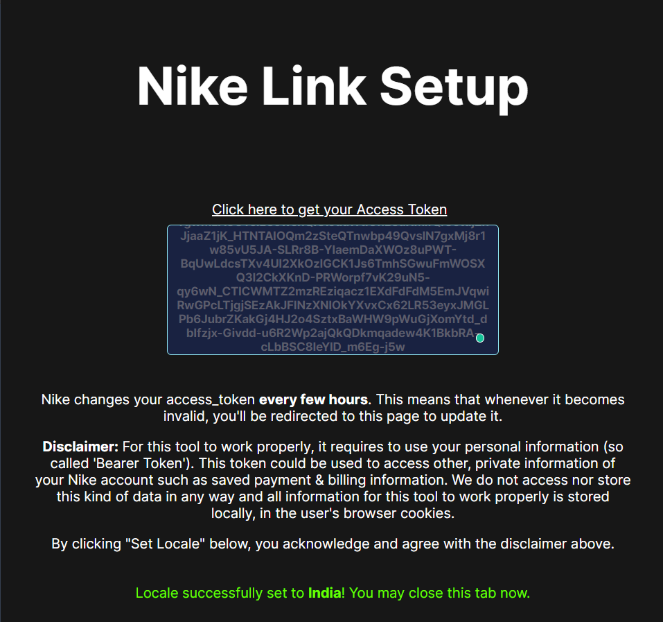
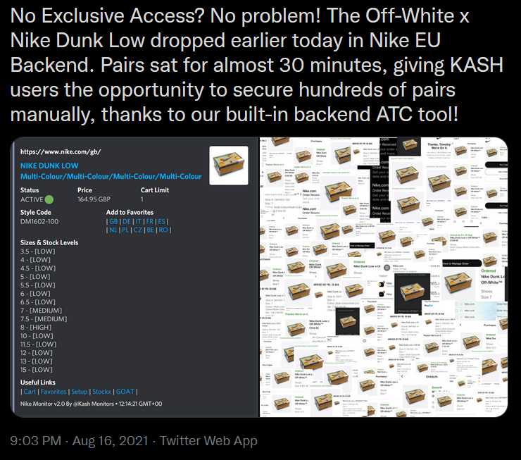

# Nike - Add to Wishlist

## HOW DO I ADD TO WISHLIST?

Adding to Favorites is a fairly straight forward process once you know what you're doing. Sadly, you might need to do this every time you want to add something that drops:

.png)

!!! info
    Make sure you're logged in on the same browser profile.

Once you find an embed/ping with this link, we move to the next step:

Click on the link, you'll be redirected to a page like this:&#x20;

.png)

To get your access token, first make sure you're logged into NIKE on that account, if not, do it. Once done, just click on [Get Access Token (a unite cookie)](https://unite.nike.com/auth/unite_session_cookies/v1).

.png)

Once copied, put it into the Add To Wishlist Config page, the one we were on earlier (which we get most of the times when we click on Add To Wishlist on any product. Now, scroll down, select your locale (India, in our case), and submit. It should leave a message like so.

Once done successfully w the right access token, this should work smoothly without this prompt for the next 1 hour (which is the validity of your access token cookie, 3600 seconds). And don't worry, this server doesn't save anything globally, just saves this on your local machine, only for you.

Now, simply click again and you should see the item in your [/cart](https://www.nike.com/in/cart) under Favorites.

.png)

An example run video on our Discord:

[Link to Message!](https://discord.com/channels/827862513034199050/860058256701653022/886335066807107654)

## **WHY USE ADD TO FAVORITES/WISHLIST?**

