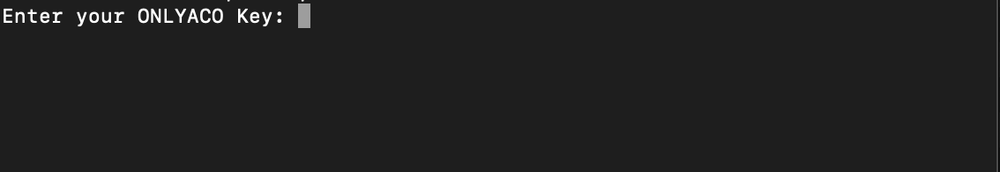
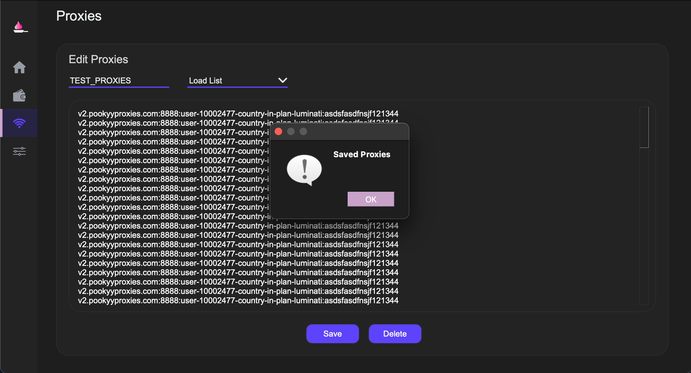
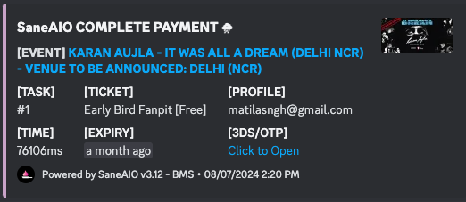

# BM (Card)

Once you've typed out or entered your ONLYACO KEY, press ENTER to continue.

!!! warning
    If you're sure about the key's validity, and it is still remarking it as "Invalid", reset your key using the "**$onlyaco reset"** command.

### PROFILE CREATION

Once started up, the first thing you'd see is the homescreen of the automation.

Navigate to the **WALLET ICON** to set your profiles.

* Fill out all relevant details carefully. **I would recommend mobile numbers to be unique.**
* Please verify the relevant state code for your particular state.
* Once filled, enter the Profile Name (identifier).
* In the email field, write your google email (gmail) where you would be receiving the e-tickets and the OTP process.
* In the password field, write your gmail's APP PASSWORD for the bot to login to your gmail with IMAP to check the OTP. To setup app passwords for IMAP, follow this video.
* For enabling IMAP: [https://www.youtube.com/watch?v=hu9xp4piYPs](https://www.youtube.com/watch?v=hu9xp4piYPs)
* For making APP PASSWORDS: [https://www.youtube.com/watch?v=hXiPshHn9Pw](https://www.youtube.com/watch?v=hXiPshHn9Pw) | [https://www.youtube.com/watch?v=6ANKk9NQ3GI](https://www.youtube.com/watch?v=6ANKk9NQ3GI)
* You need to do this for each Profile's email that you wish to run on the Insider module as there are no other alternatives to logging in currently. Make sure you enable IMAP and make app passwords on each of them.
* If you wish to add another profile, make sure you click on the drop down menu below the **SAVE/DELETE** buttons and set it to load profile again.&#x20;
* To clear filled data, click on delete when the drop down menu has Load Profile selected.
* To delete or edit a profile, navigate to the **Profile** from the drop down menu, make the relevant changes and then press the **SAVE/DELETE** button accordingly.

!!! info
    For any other queries, open a ticket on the OnlyDrops server.

### PROXIES (Alternative IPs to avoid blocks - will make the task slower)

From the previous page or any other page, clicking on the **WIFI ICON,** will take you to the proxy settings page.

* Copy your proxies or download a file from your proxy dashboard.
* Your proxies are usually in the **ip:port:user:pass** format which our automation natively supports. **IP Auth'ed** proxies are also supported and are usually easier to use for most. Ask your proxy provider or experienced users about the same and how to **IP auth** your proxies. Once IP authed, only **ip:port** is needed.
* Please make sure there is only one proxy per line (all proxies are separated).
* Make sure your proxies are not blocked, to verify - use chrome extensions like [**BP PROXY SWITCHER** ](https://chrome.google.com/webstore/detail/bp-proxy-switcher/bapeomcobggcdleohggighcjbeeglhbn?hl=en)and visit the websites, or a reliable proxy tester.
* Once entered, give your proxy list a name and press **SAVE**.
* To **enter** **another proxy list**, use the drop down menu on the right of the name and switch it to **load list** and repeat the above process.
* To **delete**, select the PROXY LIST from the drop down menu and press on delete.

!!! warning
    **NOTE:** Please make sure you only use **STICKY** proxies and not **ROTATING** proxies as your cookies might get mixed up (usually should not but to be on the safer side).

### SETTINGS&#x20;

Clicking on the **SLIDER ICON** should navigate you to the settings page of the automation.

.png)

* Enter the webhook in the **"DISCORD WEBHOOK"** field. Once done, make sure you've checked the Order Placed checkmark for you to get the webhook. Should be checked by **default** as well.
* Remember to press **SAVE** to save the webhook in the automation. You can also **TEST WEBHOOK** to make sure you've set the right webhook.
* There is also an option to trigger the browser on a successful checkout, which opens the payment page. To enable it, make sure its checked in the settings and henceforth **SAVE**d as well.

### SAVING CARD INFO

Before turning on the tool, we need to remember that the checkout process needs a CARD to checkout the ticket. \
\
**To add card detail(s), follow these steps:**

**NOTE: Before starting, please ensure that the bot is closed (or tasks are not running/idle).**

1. **Open the SaneAIO main folder** (the contents shouild be a "data" folder, an "images" folder, and the .exe/app file.
2. **Click and open the "data" folder.**
3. **Within the "data"  folder, you will find a "BMS" folder. Open that.**
4. **You will now find a cards.csv file, open that with a compatible csv editor (**[**RON EDITOR**](https://www.ronsplace.ca/products/ronseditor/download) **for Windows, or** [**Modern CSV for Mac**](https://www.moderncsv.com)**) or use any text editor (.csv are just comma seperated values, so if you follow the header format you should be okay).**
5. **Save the cards.csv file (overwrite, if prompted).**

!!! info
    **NOTE: You have to make sure you follow the format, or you could get expiry/card number formatting errors. Make sure your CSV editor isn't changing the values, and if it does, format it as Text.**

### TASK CREATION

Once all of the above have been set and saved, head over back to the homepage menu from the **HOME/HOUSE** icon.

1. Choose site/module, **BM (Card)** in this case.
2.  There is only 1 way to set/monitor an event and a ticket:

    1. **by Event ID and Ticket ID: Enter the EVENT ID (copied from the end of the event URL) of the event in the Link Field**, eg. [https://in.bookmyshow.com/events/the-under-25-summit/ET00412000](https://in.bookmyshow.com/events/the-under-25-summit/ET00412000), here, the T449is [**ET00412000**](https://in.bookmyshow.com/events/the-under-25-summit/ET00412000) and **a ticket ID in the size/variant/qty field** (which is the ID of the specific ticket category/region you want to go for), eg. **T449**.

    To get the ticket ID, use OnlyDrops' scraper in one of the channels or privately in a ticket and copy the ticket ID complementing the Price of the ticket you're looking for, if there are multiple same prices, refer to the online listing as the ticket prices/variants are in descending order. \
    \
    **Example Command:** /bms event\_id:[**ET00412000**](https://in.bookmyshow.com/events/the-under-25-summit/ET00412000)

1. Choose your profile. I would recommend naming the profiles by email usernames, so its easy for you to navigate to the same in the drop down. Make sure IMAP email and password (app password) is set correctly and saved in the profile you are planning to run.
2.  In the Size/Qty counter, there are a few ways of configuring the same.

    * **RA:** If you wish for the bot to select a random available ticket category on its own, then use RA, eg., **RA|4 .** This will make the bot select 4 tickets in a random category together.
    * **Particular Ticket Category ID:** If you wish to only go for a specific ticket ID, then copy the said ticket ID from the OnlyDrops Checker bot (use the event ID in the command to get the info), eg., T449|4.
    * **To force a specific date** (in case of multi-dated events), **use "?"** in the "ticketI&#x64;**?**&#x64;at&#x65;**|**&#x51;TY" format, eg. T449?14|4 or RA?14|4, this will force the bot to select tickets that are available for the show on the 14th, even if the event has another date. With RA, it will randomly select an available ticket category ID for the show only on the 14th.
    * NOTE: If you do not add the **quantity** by using **"|qty",** then the bot will default to adding a single ticket. I recommend adding the **"|qty"** in the size/qty field always, to avoid confusion.

3. **Set Proxy** from the remaining field. Not necessary for the BMS unless running a lot of tasks.
4. **Monitor Delay and Error Delay:** Should be explanatory, Monitor Delay is the delay it has between each check, and Error Delay is the delay the automation adds after an error. Keep 1.0 for both by default. **On a safer side to avoid blocks, increase the error delay to 3.0/5.0.**
5. **Create Task Counter:** You can increase the counter to duplicate the same task multiple times if you wish to try on multiple sizes. For each profile, only KEEP/RUN A SINGLE TASK at once or else you might encounter a cart/login/otp mixup error.

6. The bot will check for stock and will keep looping until it finds stock.
7. Once found, it will **cart the ticket and proceed to add the necessary details for checkout.** Most tickets on **BMS have a 12 minute cart hold.**
8. Tickets are either M-Tickets (QR codes) or Home Delivery, so please always keep and address added on your profiles. **If you wish to force a M-Ticket checkout, use pincode 123456 instead of your actual pincode.**
9. Once completed, it **will send you a checkout link if you've set a web hook** in the Settings tab, and that will **open the OTP/3DS page in your browser**.&#x20;

!!! warning
    **NOTE: I HIGHLY RECOMMEND SETTING THE WEBHOOK IN SETTINGS CORRECTLY, AND TESTING IT BEFOREHAND.**

**SAMPLE CHECKOUT LOGS FLOW:**

**SAMPLE WEBHOOK:**

**SAMPLE PAYMENT PAGE:**

!!! info
    **NOTE:** The final webhook also has the expiry time that keeps on changing for you to keep a check on the time left for you to complete the payment, please always complete the payment within the required time!

Once all is done, add the task and then, all other buttons should be explanatory.&#x20;

Use **Start All** to start all tasks, **Stop All** to stop all tasks, **Delete All** to Delete all tasks.

To micromanage tasks, it has buttons by the side to manage it, and each should be simple to decipher by the icons.

### COMMON FAQ/ERRORS

